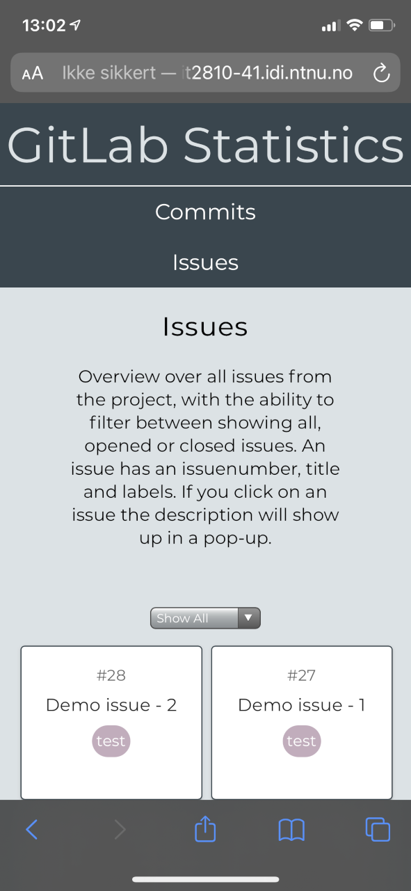
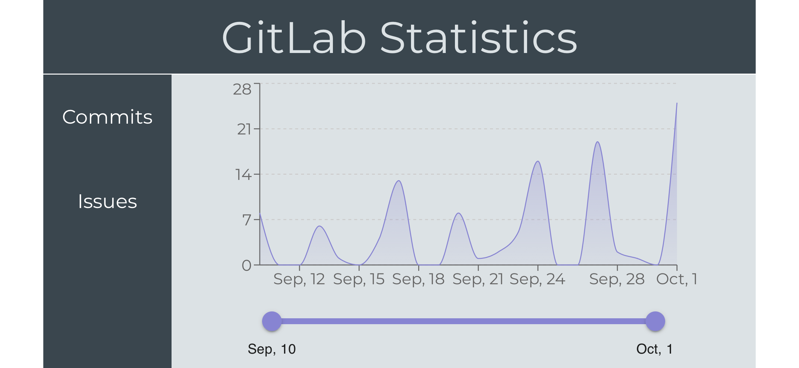
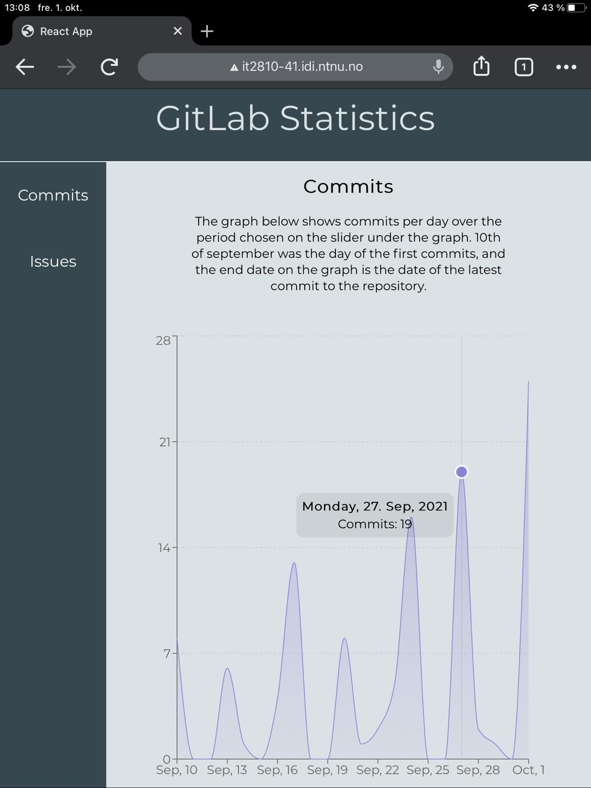
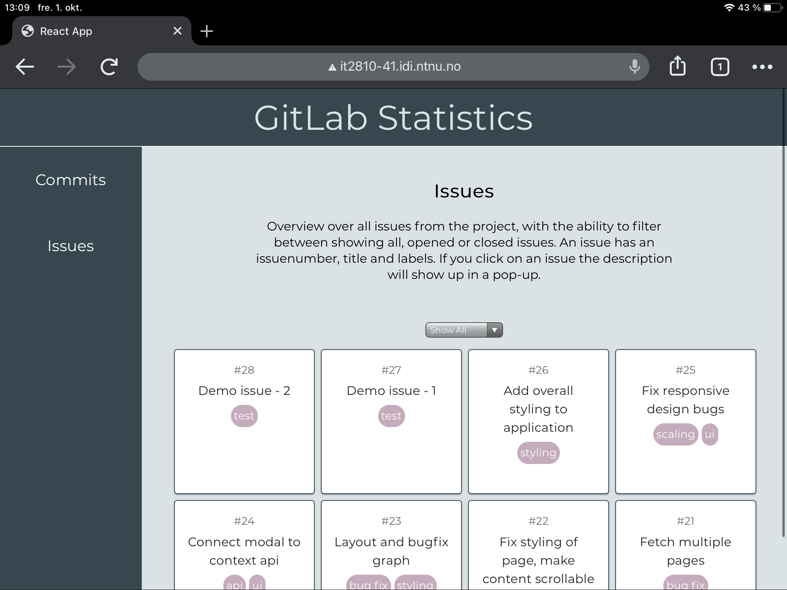

# Dokumentasjon
## Funksjonelle og klasse-komponenter
Majoriteten av appen er implementert med funksjonelle komponenter da dette er det som regnes som best practice, i tillegg til at det er det som er blitt mest vanlig de siste årene. Da kan man også ta i bruk hooks og state for å lettere kontrollere tilstanden på komponenter og slippe å bruke `this` som kan føre til mye forvirring. For å oppfylle kravene om at appen skal inneholde klasse-komponenter så har vi implementert sidebaren som en klasse-komponent. 

Sidebar komponenten tar i bruk lifecycle metoden `componentWillMount`, som bare kan brukes i klasse-komponenter. Lifecycle metoder er tilsvarende hooks for funksjonelle komponenter. Vi henter sidebarView fra localStorage for å hente denne lagrede verdien om hvilket innhold som skal vises. `componentWillMount` metoden kjøres før `render()`, dvs. hvis man endrer verdier komponenten er avhengig av, vil ikke komponenten rendres og deretter re-rendres. Dette hadde skjedd hvis vi gjorde denne oppdateringen i `render()` metoden.

For å rendre sidebaren har vi brukte lifecycle metoden render, vi returnerer html elementene som skal vises. `render()` for klasse-komponenter tilsvarer det en funksjonell klasse returnerer.

Bruk av context API er litt annerledes for klasse-komponenter. Vi bruker den statiske `contextType` for å lagre contextAPIets `contentContextUpdate`, som er funksjonskallet for å oppdatere content i context API’et.

## Props, state og context API
State er brukt i omtrent alle de funksjonelle komponentene. For eksempel er det brukt til å lagre alle commits eller for å se om et `IssueCard` er åpent. Props er også brukt noen steder hvor det er hensiktsmessig. For eksempel har Commits komponenten ansvar for å hente data fra APIet, mens `CommitChart` har ansvar for å visualisere dataene. Her brukte vi props for å sende dataen fra `Commits` til `CommitChart`. Props er brukt flere steder i prosjektet, men bruksområdet er det samme, altså at man sender data fra en parent til en child.

For å dele data på tvers av komponenter har vi også brukt context APIet. Måten vi valgte å gjøre det på var ved å lage egne filer som håndterte all logikken ved bruk av context. Hver fil inneholder to contexter hvor en eksponerer en variabel som inneholder data og en eksponerer en funksjon for å endre denne dataen. For at dato-slideren skulle kunne manipulere data som var vist på grafen pakket vi disse inn i contexten `DateIntervallProvider`. Dette tillot `DateSlider` å endre intervallet ved hjelp av en custom hook `useDateIntervallUpdate`. I tillegg kunne da `CommitsChart` få tilgang til det samme intervallet ved å bruke hooken `UseDateIntervall`. Siden `CommitsChart` og `DateSlider` er komponenter på samme nivå var det ikke et alternativ å bruke props og vi konkluderte da med at context apiet var den beste løsningen.
Løsningen er også brukt for i `App` for å holde styr på hvilken side som vises, dette gjøres gjennom sidebar komponenten, men logikken er på mange måter den samme. I denne komponenten har vi overflødig kode for å vise at vi har forståelse for de forskjellige måtene man kan bruke context api i klasse komponenter. Vanligvis vil man enten bruke en consumer i render metoden, eller bruk av this.context og importere selve contexten. I sidebar har vi implementert begge deler.

## Data fra GitLab med AJAX
Vi har en egen fil med utility-funksjoner for å hente data fra GitLab. Alle funksjonene her er asynchronus slik at siden kan rendres mens vi venter på svar fra GitLab apiet. Vi ønsket å gjøre funksjonene allsidige slik at de kunne brukes til å hente flere typer responser (`commits` og `issues`) fra GitLab og det er grunnen til at vi har brukt en liste av typen `any` for å samle opp responsene. For å løse fetching for tilfeller med mange issues eller commits,  har vi en while-løkke som vil fortsette å hente ut data med perpage-antall på 100, helt til det ikke er mer å hente.

## HTML web-storage
Vi har brukt session storage på filtrering av issues. For hver gang det velges en ny filtrering vil det lagres i session storage, slik at samme issues vil vises ved oppdatering av nettsiden. I sidebaren kan man bestemme om man vil vise commits eller issues, og dette valget blir lagret i local storage slik at brukeren vil få samme visning av siden ved neste besøk. Vi bestemte å lagre filtreringen i session storage og sidebar-valget i local storage fordi vi tenker på det som brukervennlig.

## Responsiv web design
Media queries er brukt til å danne et responsivt design. Menyen for å velge commits eller issues vil ved bred skjerm være plassert på venstresiden, mens den flyttes til under header for smale skjermer - inkludert mobile enheter. I tillegg vil menyen og noe av teksten skalere på en måte som gir bruker hensiktsmessig visning av alle sideelementer på svært små skjermer. Vi fant det ikke hensiktsmessig å bruke bilder i prosjektet, men har derimot inkludert en graf. Grafen bruker resposiveContainer fra recharts-biblioteket som sørger for at den skalerer riktig i bredden. 

## Testing
For testing har vi skrevet tre snapshottester: en til hele applikasjonen og en til hver av hovedkomponentene commits og issues. I tillegg har vi brukt userEvents til å sjekke om endringer av dropdown-menyen for filtreringen av issues fungerer slik vi vil. For å kjøre testene kjører man ‘npm test’ inne i ‘prosjekt-2’ i terminalen.

For å teste responsivitet og brukergrensensnitt har vi gjort brukertester på skjermer med ulik vindusstørrelse. Underveis i prosjektet har vi brukt ‘inspiser’ for å regelmessig sjekke at applikasjonen oppfører seg som forventet. Etter vi deployet applikasjonen sjekket vi appen på andre enheter (iPhone, iPad). Her er noen bilder av brukertesting på mobile enheter. 

 
